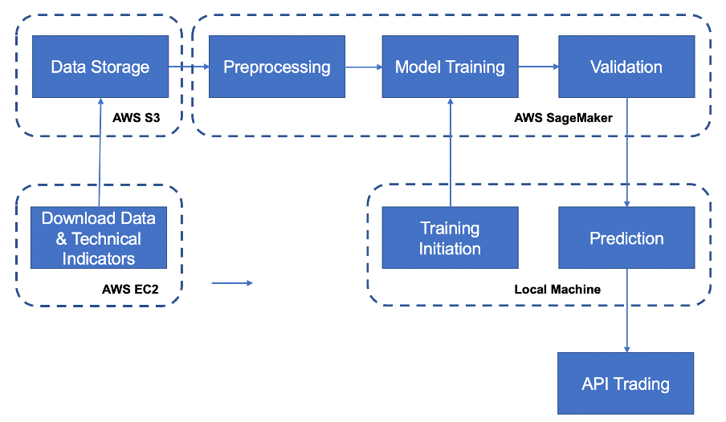
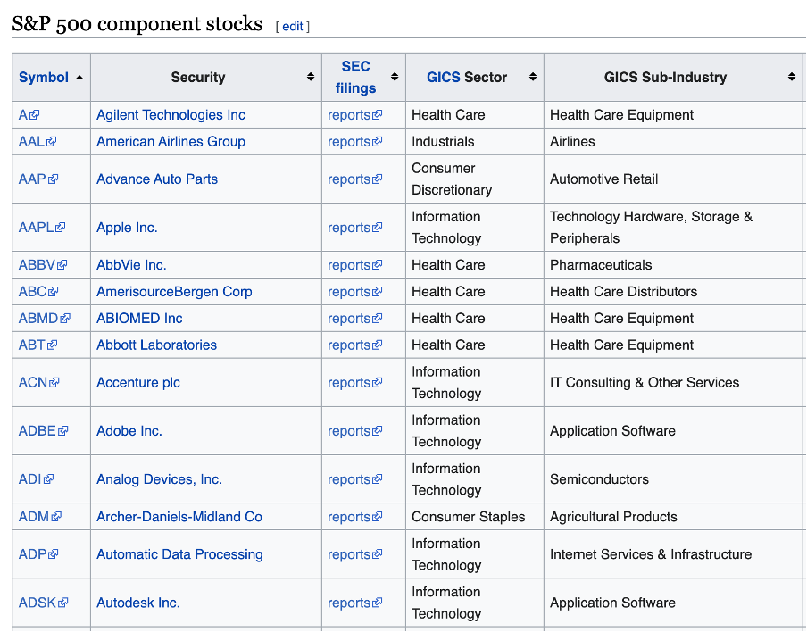
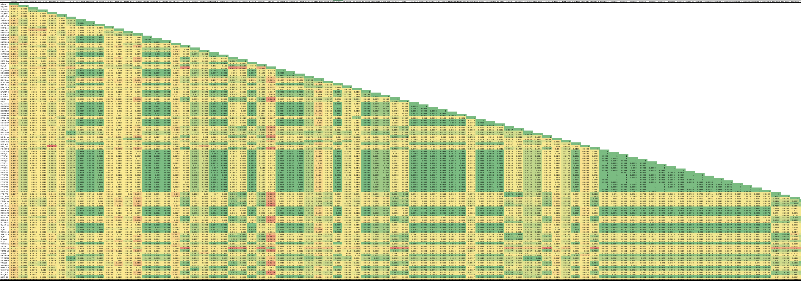
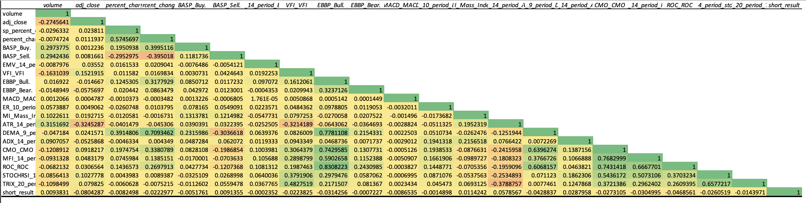
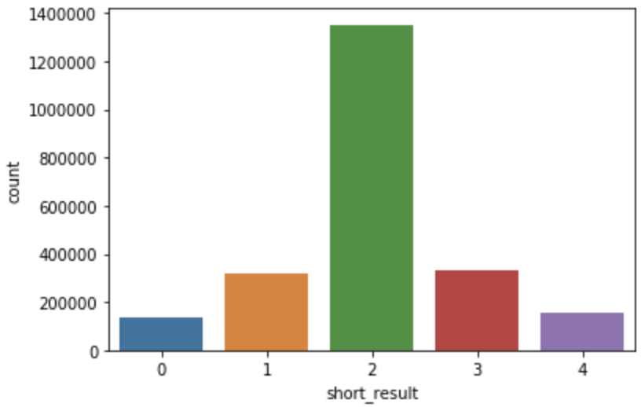
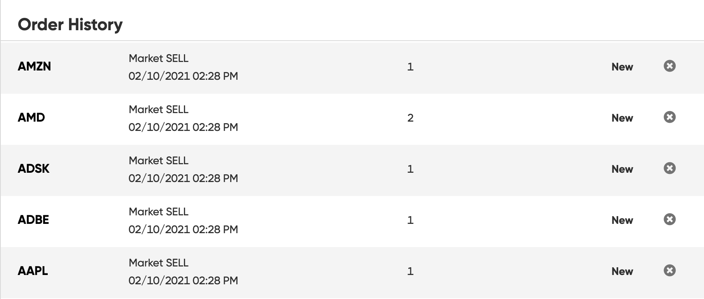
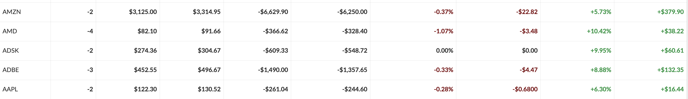

# Stock Trading Analysis using Machine Learning Preditions
A Repository for Stock Traing Project

## Disclaimer

Not a financial advice!

This analysis was conducted just of personal interest and for personal needs. It is just a personal experience. It does not imply any advice or pretend to be truthful. The code presented here can be definitely improved in quality. The resultsts are subjective and may deviate from reality. This project covers only one small part and few possible techniques, used in stock market analysis. There are plenty more methods that can outperform the used ones. There are more many factors that could influence the stock market movement, which are not analyzed in the project. Even the successfully tested models may not yield desired results. 

However I would welcome any friendly discussions, questions, suggestions and comments. Please also be free to use this analysis in parts or in full for any purposes, yet reference would be appreciated. :) 

## Foreword

This analysis was inspired by [Predicting Short-Term Stock Movements with Quantitative Finance and Machine Learning in Python](https://towardsdatascience.com/predicting-short-term-stock-movements-with-quantitative-finance-and-machine-learning-in-python-e6e04e3e0337).

After diving deep into the analysis, I got an idea to re-create something similar, just in my own way. The in-detail describtion of the process below.


## Goals

to provide a machine learning decision model that predicts short-term stock movements based on technical indicators and outputs the most suitable decision. The project is aimed to provide more accurate results, as the results obtained by simply guessing the outcome or by using traditional trading/investment methods.


## High Level Pipeline/Architecture

The following chart represents high-level flow from the very beginning to the end:


* To overcome bandwith limitaions on the local machine, AWS EC2 instance was used to download historical data and push it to AWS S3 for storage via CLI.
* AWS SageMaker Instance was used to pre-process the data, train and validate the model. Model and is then stored back on S3.
* Training script is maintained locally and getting pushed as a custom virtual container to SaegMaker, when we need to initialize training job, yet training on local machine is also possible.
* Once we want to obtain predictions, we simply download the model and collect the new data directly from a local machine (predictions does not require a lot of data, as training data). 
* Predictions are stored and trading orders could be made to a broker via API.


## Detailed Description

* Environment used: MacOS Big Sur 11.1 (Intel), Python pyenv+miniconda+3.8.5 / pyenv+3.9.0

### Step 1: Getting the Data

This step describes how data was acquired and key points of first-level pre-processing.

#### List of Companies

Firstly, we have to obatain the data for the future machine learning model. The data used in this project is the stock-related data and indicators for the S&P 500 companies. The current up-to-date list is always located in a table form in Wikipedia, which isgetting scraped and saved into text files for future use. The exctract from the table:


*The idea was taken from the article mentioned in the foreword.*

#### Historical Stock Data

Oncer we got the list of companies, we can collect the historical trading information. The list of companies is passed to a function that is using `pandas Datareader` library to download stock information from Yahoo Finance. The function downloads historical trading data (open, close, volume, etc.) for each company starting 2000.01.01 and with flexible end date of up to last full trading day. At the moment of writing - 2021.01.15, using span of more than 20 years (or maximum available). At this point historical return of S&P500 index is also calculated along the same period, to be used in latter calculations.

#### Technical Indicators

The main features which the model would be learning from are going to be technical indicators. In the one loop, as the historical data is gathered from Yahoo, numerous technical indicators were calculated for each stock using `finta` library. Finta supports more than 80 indicators, with the full list available in detail on [finta GitHub](https://github.com/peerchemist/finta). 

In general there are two problems in using out of the box indicators from finta:
1. Many of technical indicators presented are either highly correlated one with another (for example, different oscillator type indicators are suppose to show the same thing, just with slightly different formula). And while for human it might make sense to see the difference, for the machine it might be an overkill, so some highly corellated indicators should been removed. 
2. Moreover, many indicators are really bound to the stock price, e.g. Moving Averages (SMA, EMA, etc. - the larger is the nominal price of one share, the larger is stock's EMA. That means, The EMA value of AMZN is constantly a large number, while an EMA of AAPL (after split) is at least 10 times smaller, but purely by logic, it does not mean, AMZN is going to perform better or worse. Therefore some indicators had to be processed in some way, before getting used.

After a quick getting a correlation matrix of a small part of data, we can clearly see the abovementioned examples:


While yellow is near 0, we can see lots of green (strong positive correlation close to 1) - the first problem. Also, the first two columns - volume (slight orange) and close price (slight green) are a bit correlated to many indicators - the second problem.

After some processing, the results are still not ideal, but much better:


By getting rid of some indicators and processing few others, the final table looks like this:

| Indicator                                       | Short name | Processing                                       |
|-------------------------------------------------|------------|--------------------------------------------------|
| Average Directional Index                       | ADX        |                                                - |
| Average True Range                              | ATR        |           divide by close price - "relative ATR" |
| Buy and Sell Pressure                           | BASP       |                                                 - |
| Chande Momentum   Oscillator                    | CMO        |                                                 - |
| Double Exponential Moving   Average             | DEMA       |                            used "change of DEMA" |
| Bull power and Bear Power                       | EBBP       |                                    "as % of EMA" |
| Ease of Movement                                | EMV        |                                                -  |
| Kaufman Efficiency   Indicator                  | ER         |                                                -  |
| Moving Average Convergence   Divergence         | MACD       |                                 "change of MACD" |
| Money Flow Index                                | MFI        |                                               -   |
| Mass Index                                      | MI         |                                                -  |
| Rate-of-Change                                  | ROC        |                                                -  |
| Stochastic RSI                                  | STOCHRSI   |                                                -  |
| Triple Exponential Moving   Average Oscillator  | TRIX       |                                                -  |
| Volume Flow Indicator                           | VFI        |                                                -  |

As an addition pre-procesing step at this stage, the first 100 obsercations (trading days) from each equity were removed, so that all indicators could be calculated (e.g. you can calculate an EMA today, if you don't have several historical points). In addition, that would help in removing the [IPO Bias](https://www.researchgate.net/publication/331742656_Behavioural_Bias_in_IPO_Market).

Following that 21 (by default) last days for each asset are also deleted (see description of target variable y below).

### Price Change Variable (Target Variable y)

We will tackle this problem from the classification point of view. We can capture the abovemntioned technical indicators at one point in time, and then see how did the price change after a certain period. Based on this, we can make classify each day as "what did the indicators were telling us" - to buy, sell or hold the current equity?

The process of creating target variable is as follows:
* Calculating daily relative change:
  * for each datapoint, a relative (%) change between two current day and previous day is calculated (i.e., asset daily return);
  * similarly, the change (daily return) of S&P 500 index is calculated for the same dates;
  * relative change in this case is the difference between asset return and index return. that implies that assets that are going completely in line with the index are not considered very noteworthy. For instance, an asset A, which gained 5% while S&P 500 gained 7% is considered underperforming, results in weaker relative change than asset B gaining 1%, while S&P lost 4%. 
* Future relative change:
  * the above-mentioned relative change is then observed in the future and calculated for the next several trading days (21 by default - an average of one trading month);
  * the result represents how well asset is going to perform in the future 21 days, compared to S&P 500 index.
* Classification:
  * change less than ±5% is considered small and results in ‘hold’ decision;
  * increase between +5% to +10% considered meaningful and results in ‘buy’ decision, and vice-versa ‘sell’ for -5% to -10%;
  * what is more than ±10% yields ’strong buy’ or ‘strong sell’; result.

*The idea was taken from the article mentioned in the foreword and slightly adjusted.*

#### Miscellaneous Processing 

As to other indicators (not finta-related) to be used in the future, following are getting calculated and/or processed:
* calculating daily percetage change in asset price;
* calculating daily percentage change in S&P 500 index;
* getting adj. close and volume data scaled with `MinMaxScaler` individually for each stock. As mentioned above, since the asset prices can be very various in their nominal values, they should be properly scaled, in order to be used (I believe these indicators should be used, since we can compare how does current price/volume stands in historical terms of this individual asset). And scaling brings it to one level.

In the end of this process, data is saved as csv file and stored, to be pre-processed and used for the machine learning later.

### Step 2: Data Pre-processing

Despite most of processing has been already done, this step includes main details on data processing directly required before using that in a machine learning task.

#### Data Cleaning & Processing

The following steps are now performed:

•	anonymizing the data (i.e., excluding ticker symbols and dates) – all datapoints are going to be independent from one another. It does not matter for which ticker and at what date this observation was collected, only the patterns between variables will matter;
•	removing redundant stock price values (open, high, low, close), leaving only adj. close & volume;
•	clearing rows with missing data, if any;
•	changing variable types for lesser memory usage to float32;

In the end, the dataset looks like that:

| Column                             | Dtype   |
|------------------------------------|---------|
| index                              | float32 |
| volume                             | float32 |
| adj_close                          | float32 |
| sp_percent_change                  | float32 |
| percent_change                     | float32 |
| BASP_Buy.                          | float32 |
| BASP_Sell.                         | float32 |
| EMV_14_period_EMV.                 | float32 |
| VFI_VFI                            | float32 |
| EBBP_Bull.                         | float32 |
| EBBP_Bear.                         | float32 |
| MACD_MACD                          | float32 |
| ER_10_period_ER                    | float32 |
| MI_Mass_Index                      | float32 |
| ATR_14_period_ATR                  | float32 |
| DEMA_9_period_DEMA                 | float32 |
| ADX_14_period_ADX.                 | float32 |
| CMO_CMO                            | float32 |
| MFI_14_period_MFI                  | float32 |
| ROC_ROC                            | float32 |
| STOCHRSI_14_period_stochastic_RSI. | float32 |
| TRIX_20_period_TRIX                | float32 |
| short_result                       | int64   |

In total there were around 2.3 million observations.

#### Target (y) grouping to classes & Undersampling

As described before, at this point the grouping is performed - a total of 5 groups (from 0 to 4: strong sell, sell, hold, buy, strong buy). If
we examine the distribution of classes:


We can see that there is a high prevalence of 'hold' decisions, which is fair - stocks do not go often very far up or down within one month. But that impacts the performance of our model. 

Therefore, random undersampling was performed (as there is a lot of data anyway, to match the distribution):


That left us with approx. 665k rows of data.

#### Splitting & Scaling the Data

Data then got split into training, test and vaildation sets with the proportion of 98%/1%/1%.

Using the `StandardScaler` all three sets were scaled (fit only the training data). Scaler is then saved for future use for making the predictions.

Aftrer that data was completely processed, stored once again in form of h5 files and now is ready to be used in a model.

### Step 3: Training & Evaluating the Model

In this section the processed data is used in model training.

#### Training

The train & test sets were split on features (X) and targets (y). After trying several classification algorithms and hyperparameters, I've stopped on the `RandomForestClassifier` from `sklearn`. The detailed training parameters are:

* Classifier: Random Forest.
* Number of trees: 300
* Critrerion: Entropy
* Bootstrap: True
* Cross-Validation: 5-fold cross-validation for each hyperparameter combination.
* Model selection: Average F1-Score

### Validation

The model performance as per multiple metrics looks as follows:

```
# 0: Strong sell
# 1: Sell
# 2: Hold
# 3: Buy
# 4: Strong Buy

Classfification Report:

              precision    recall  f1-score   support

           0       0.55      0.58      0.57      1320
           1       0.47      0.36      0.40      1306
           2       0.43      0.51      0.47      1352
           3       0.45      0.35      0.39      1301
           4       0.56      0.67      0.61      1377

    accuracy                           0.50      6656
   macro avg       0.49      0.49      0.49      6656
weighted avg       0.49      0.50      0.49      6656


Confusion Matrix:

[[771 139 152  75 183]
 [238 467 334 126 141]
 [135 186 687 210 134]
 [138 131 304 451 277]
 [121  81 115 136 924]]

Accuracy: 0.496
Balanced Accuracy: 0.493
Precision: 0.491
Recall: 0.496
F1 Score: 0.489
Kappa: 0.369
```

So on average it does look that about in a half of cases the outcomes were predicted correctly. Not great, but not terrible. We should keep in mind that there in our 5 classes, some of them are actually in a close relation one from another. While sometimes it could be imporatnt and interesting to see, when do we have strong buy order or just normal buy (e.g. we may adjust the sum of investment based on that), it is not that critical - if an algorithm has predicted buy instead of strong buy or vice-versa, we can still try to count it as a success.

Therefore, we can take a look, how would it look like with only 3 classes (buy, hold & sell):
```
# 1: Sell
# 2: Hold
# 3: Buy

Classfification Report:

              precision    recall  f1-score   support

           1       0.67      0.62      0.64      2626
           2       0.43      0.51      0.47      1352
           3       0.67      0.67      0.67      2678

    accuracy                           0.61      6656
   macro avg       0.59      0.60      0.59      6656
weighted avg       0.62      0.61      0.62      6656


Confusion Matrix:

[[1615  486  525]
 [ 321  687  344]
 [ 471  419 1788]]

Accuracy: 0.614
Balanced Accuracy: 0.597
Precision: 0.623
Recall: 0.614
F1 Score: 0.618
Kappa: 0.405
```

That is already around 60%, much better! Although I have no real data on how accurate on average the technical analysis is, we can still consider it as not bad result and try to do some predictions on the new data. We save the model 

### Step 4: Making Predictions & Trading

#### Predictions

By changing one parameter `pred` from 0 to 1, it is possible to gather not historical data, but rather last full trading days data for the stocks specified - exactly what is necessary for predicting. We are loading our saved model and scaler, making all necessary transformation as previously and predicting the data.

By getting some predictions on random equities, we get something like this:

```
ticker  predict
  AAPL        1
  ADBE        1
  ADSK        1
   AMD        0
  AMZN        1
  ATVI        0
 CMCSA        0
   CRM        1
  CSCO        2
   CSX        0
   
  # Means strong sell=0, sell=1. hold=2, buy=3, strong buy=4
```

That is some negative movement in the market predicted for several tech stocks for the next month! We save them to csv in order to load to our trading script.

#### Trading

We can also automate our actual trading based on the predictions. Using a broker which supports automatic API calls to place orders (I've used synthetic (paper) account on Alpaca Markets, not an advertisement), we can make API calls to place orders for us, using very simple loop. Let's assume, if the model has predicted stong buy/sell, we will place order for 2 shares, if a normal buy/sell - 1 share. If there is hold, we are not doing anything. In the result it would look like that:

```
•	Order for: AAPL placed successfully! Quantity: 1. Position: sell.
•	Order for: ADBE placed successfully! Quantity: 1. Position: sell.
•	Order for: ADSK placed successfully! Quantity: 1. Position: sell.
•	Order for: AMD placed successfully! Quantity: 2. Position: sell.
•	Order for: AMZN placed successfully! Quantity: 1. Position: sell.
•	Order for: ATVI placed successfully! Quantity: 2. Position: sell.
•	Order for: CMCSA placed successfully! Quantity: 2. Position: sell.
•	Order for: CRM placed successfully! Quantity: 1. Position: sell.
•	Prediction for: CSCO is hold! No order opened.
•	Order for: CSX placed successfully! Quantity: 2. Position: sell.

```
And the orders now appear in the overview from the web panel of a broker:


## Results

As the result, it is now possible to make short-term (month) predictions for stock movements and make automated trades. After a month, we can take a look at the resutls. (Two last columns represent our total gain in % and in $).



It might be just a coincidence and the overall bearish trend in the market, yet the algorithm this time was not wrong with it.

## Licensing

MIT License
Copyright (c) 2021, Artjoms Formulevics
